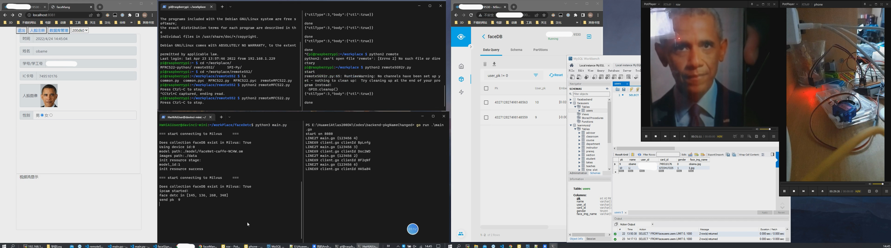

# altals200dk-Face-Recognition

简单的门禁控制，支持人脸识别与RFID卡读取

## 整体结构


## 预览



## 注意事项

- faceRecognition/中的acl资源调用仅能在atlas系列产品使用
- remoteMFRC552与remoteSG92R均在树莓派运行,通过python2交互GPIO
- faceNet模型文件来自[taylorlu/Facenet-Caffe](https://github.com/taylorlu/Facenet-Caffe),需要自行转换
- 结构图中Camera为视频流，该项目使用rtmp视频流,可更换为opencv支持的视频流,或自行读取

## 软件版本

atlas200dk:

``` bash
cat /var/davinci/aicpu_kernels/version.info
{
Get system version(21.0.1) succeed, deviceId(0)
        {"device_id":0, "version":21.0.1}
}

cat /home/HwHiAiUser/Ascend/acllib/version.info
Version=1.78.T20.0.B200
acllib_acl_version=1.0
acllib_dvpp_version=1.0
required_driver_ascendhal_version=4.0.0
required_driver_dvppkernels_version=1.1
required_driver_tsfw_version=1.0

HwHiAiUser@davinci-mini:~/Ascend/ascend-toolkit$ ls
5.0  5.0.2.alpha003  latest  set_env.sh

A200dk-npu-driver-21.0.1-ubuntu18.04-aarch64-minirc.tar
固件与驱动版本 1.0.10.alpha 
```

milvus: 2.02

golang: go1.17.7 windows/amd64

## 数据库schema

### 人脸特征向量

milvus  

#### collection:faceDB

| Name       | Type                | params |
| :--------- | :------------------ | :----- |
| pk         | int64               | PK,AI  |
| user_pk    | int64               | NN     |
| embeddings | FloatVector,dim=512 | NN     |

### web界面账户控制

mysql  

#### 库:facebackend  

表:sessions
| Name       | Type         | params         |
| :--------- | :----------- | :------------- |
| id         | BIGINT       | PK,NN,UQ,UN,AI |
| uuid       | VARCHAR(64)  | NN,UQ          |
| email      | VARCHAR(255) |                |
| user_id    | INT          | NN             |
| created_at | TIMESTAMP    |                |

### 用户

表:users
| Name       | Type         | params         |
| :--------- | :----------- | :------------- |
| id         | BIGINT       | PK,NN,UQ,UN,AI |
| uuid       | VARCHAR(64)  | NN,UQ          |
| name       | VARCHAR(255) |                |
| email      | VARCHAR(255) | NN,UQ          |
| password   | VARCHAR(255) | NN             |
| created_at | TIMESTAMP    |                |

#### 库:faceusers

表:users
| Name          | Type        | params   |
| :------------ | :---------- | :------- |
| pk            | INT         | PK,NN,AI |
| name          | VARCHAR(15) | NN       |
| user_id       | VARCHAR(15) | NN       |
| card_id       | VARCHAR(15) | NN       |
| gender        | TINYINT     | NN       |
| face_img_name | VARCHAR(50) |          |

## links

[davidsandberg/facenet](https://github.com/davidsandberg/facenet)

[mtcnn_cv2](https://pypi.org/project/mtcnn-opencv/)

atlas200dk 1.0.10.alpha 文档残缺，此为[1.0.9.alpha](https://support.huaweicloud.com/devg-cpp-Atlas200DK202/atlasapi_07_0217.html)

[mxgxw/MFRC522-python](https://github.com/mxgxw/MFRC522-python)
