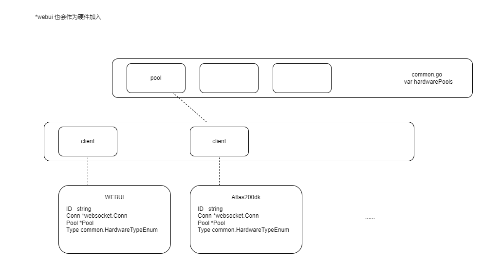

# (硬件管理)服务器

## 连接池与客户端

接受到新websocket连接后，直接接受客户端发送的 AuthMsg 结构消息（需要改进），根据消息中的池ID搜索是否存在连接池，不存在则新建并加入列表存储。注意即使连接池ID为空，仍会创建连接池。同样，无法分辨的客户端类型将分配“默认”类型并警告。

每当客户端注销，都会检查连接池内客户端数量，空连接池将会被销毁。



## 消息

除认证消息外（需要改进），所有设备间通过websocket链接收发控制消息进行交互。
各种消息结构见message.go CtlMsg

``` golang
type CtlMsg struct {
 //the control commad type, check MessageCtlTypeEnum
 //but set "int"
 CtlType int `json:"ctlType"`
 //body depends on ctlType, check gateManag.MessageThrough
 Body json.RawMessage `json:"body"`
}
```

收到消息后，根据控制命令类型，switch到对应处理流程，解析消息体。
